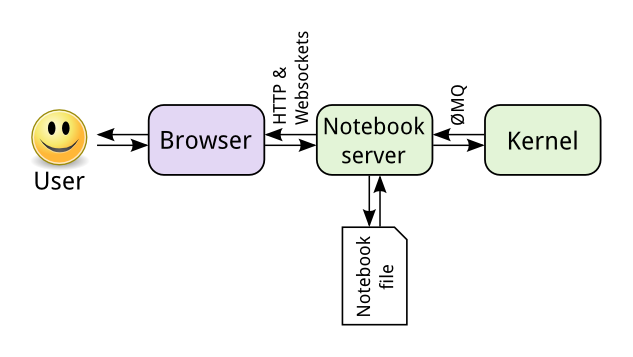
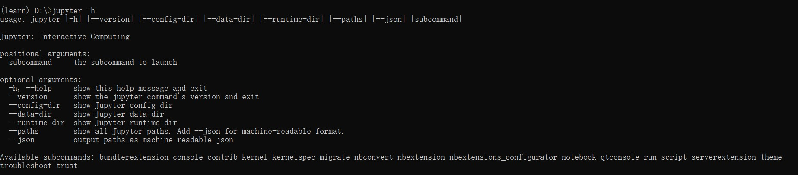
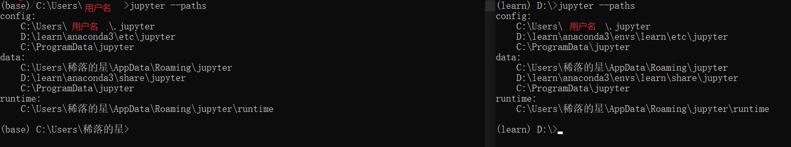
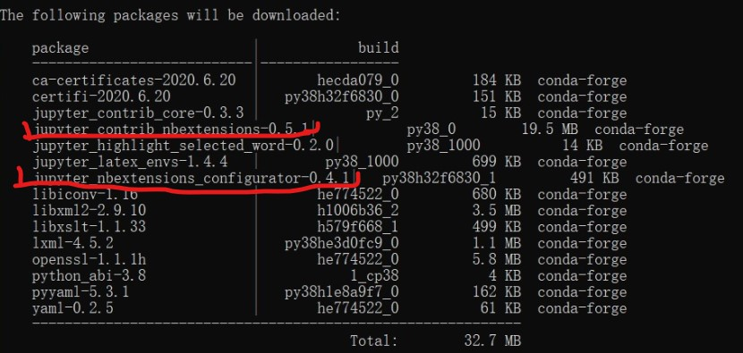
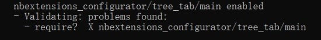
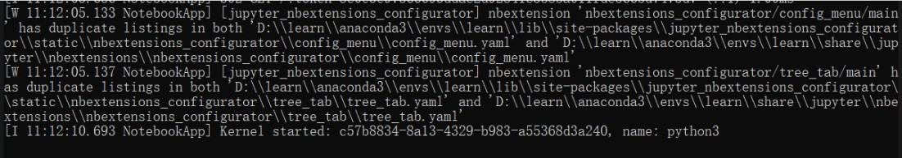

在学习数据分析相关的一些模块时接触到了 jupyter notebook，说实话，的确挺好用的，尤其在查看一些中间的结果时。
然后装主题，装插件，一点点解决中间遇到的各种蛇皮错误。到现在终于像点样子了。
不过前前后后花了两天左右，本想再好好试试 jupyter lab 的，还是以后再说吧。

<!-- more -->

# 1. 开始准备

## 1.1. 快速进入指定环境

前面有提到 anaconda 为什么不用配置环境变量，在此处可以仿照 anaconda 那个 cmd，自己实现一个进入特定环境的 cmd。否则每次都要自己切换环境，实在麻烦。

1. 创建 cmd 快捷方式
2. 修改快捷方式中的属性为

```
%windir%\System32\cmd.exe "/K" D:\learn\anaconda3\Scripts\activate.bat D:\learn\anaconda3 && conda activate learn && d:
```

> && 后面接 cmd 中可以写的语句，相当于按顺序在 cmd 中执行

这样避免了每次都要打activate指令

## 1.2. 了解jupyter

Jupyter Notebook 的本质是一个 Web 应用程序，便于创建和共享文学化程序文档，
支持实时代码，数学方程，可视化和 markdown。 用途包括：数据清理和转换，数值模拟，统计建模，机器学习等等

- 架构图：
  > 
  - 服务器读取文件，并藉此生成html页面
  - 用户使用浏览器访问页面，进行交互操作
  - 服务器接收用户代码输入，调用内核kernel处理
    > jupyter 支持几十种语言，ruby,r等都可以通过添加内核完成支持
  - 服务器读入内核输出，并返回结果输出到浏览器上

- 拓展：
  > 服务器接收用户的代码数据具体原理拓展：[网址](https://www.cnblogs.com/wuyongqiang/p/8040225.html)

- 历史(摘自wiki)：
  > 2014年，Fernando Pérez宣布从IPython中衍生出一个名为Jupyter的项目。IPython继续以Python shell和Jupyter内核的形式存在，而IPython Notebook和其他与语言无关的部分移到了Jupyter名下。Jupyter是语言无关的，它的名称是对Jupyter支持的核心编程语言的引用，这些语言是Julia、Python和R， 它支持几十种语言的执行环境（也就是内核），这些语言包括Julia、R、Haskell、Ruby，当然还有Python（通过IPython内核）。

  > 2015年，GitHub和Jupyter项目宣布Jupyter Notebook文件格式（.ipynb文件）在GitHub平台上可以原生渲染。

## 1.3. jupyter 命令与子命令

通过`jupyter -h`可以查看所有命令参数以及子命令。比如通过`jupyter --paths`可以查看 jupyter 所有相关的路径。



此文主要涉及3个命令：
- jupyter notebook： 在当前目录开启jupyter-notebook
- jupyter nbextension： 插件管理
  - jupyter nbextension list
  - jupyter nbextension enable
  - jupyter nbextension disable
  - jupyter nbextension install
  - jupyter nbextension uninstall
- jupyter nbconvert： 文档转换

<p style="color:red">可以发现jupyter安装完成后本身就有 jupyter nbextension命令，也就是有加载jupyter插件的模块，而我们要做的，就是添加插件</p>

## 1.4. jupyter 相关路径

`jupyter --paths`结果：



- 三类：
  1. config:配置文件路径
  2. data：数据文件路径，包括插件文件
  3. runtime:运行时生成文件路径，包括临时html等
- 三行分别对应：
  > 通过`jupyter nbextension -h`可以查看插件安装相关指令和选项
  1. 第一行目录是 **为用户安装**对应目录，对应`--user`
  2. 第二行目录是 **在所在env环境安装**对应目录，`--sys-prefix`。不同env，只有该条不同
  3. 第三行目录是 **全局安装**对应目录，对应`--system`,**默认**
- py模块：jupyter相关的的py模块位于：`env路径/Lib/site-packages/`下，和所有python第三方模块位置相同
- jupyter命令所在位置：`env路径/Scripts/`

# 2. 配置过程

## 2.1. 直接安装(不推荐)

> 但非强迫症应该够用

- 使用anaconda安装jupyter插件:
  ```
  conda install -c conda-forge jupyter_contrib_nbextensions
  ```
  > 主要使用模块:
  > 
- 模块大致说明
  - jupyter_contrib_nbextensions
    > contrib 时 contribute 的缩写
    - 说明：几十个插件的包和相关依赖的python模块，Jinjia2模版等
    - [详情见github地址](https://github.com/ipython-contrib/jupyter_contrib_nbextensions)
  - jupyter_nbextensions_configurator
    - 说明：插件控制的图形化模块，可以进行插件的开启，关闭与配置
    - [详情见github地址](https://github.com/Jupyter-contrib/jupyter_nbextensions_configurator)

- 问题：安装后会可能出现这种错误(此处只是演示，实际会超长一串)：
  - 问题1：插件启用错误
    > 
  - 问题2：配置文件重复
    > 

<br>

当初遇见的主要就是这俩问题，一脸懵逼，github上到处查，之后甚至删环境重装也没解决（崩溃）。

## 2.2. 自定义安装

> 给那些看见warning就心烦的人

- 开始之前，推荐先去[github详情页](https://github.com/ipython-contrib/jupyter_contrib_nbextensions)把项目下载下来，避免误删啥东西
- vim插件安装示例：


# 3. 最后


