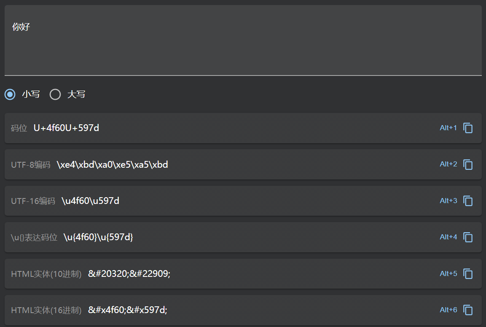

之前针对java的编码做过一些笔记，最近在看c，记录下关于编码问题的测试。

<!-- more -->

# 测试代码

```c
#include <stdio.h>
#include <stdlib.h>

int main(int argc, char *argv[])
{
    static char hello_cn[] = "你好";
    printf("%s", hello_cn);
    return EXIT_SUCCESS;
}
```

# elf 文件内中文的编码

readelf -a

```
Section Headers:
  [Nr] Name              Type             Address           Offset
       Size              EntSize          Flags  Link  Info  Align
  ...
  [23] .data             PROGBITS         0000000000601020  00001020
       000000000000000b  0000000000000000  WA       0     0     1
  ...

Symbol table '.symtab' contains 71 entries:
  ...
  42: 0000000000600e10     0 OBJECT  LOCAL  DEFAULT   18 __frame_dummy_init_array_
  43: 0000000000000000     0 FILE    LOCAL  DEFAULT  ABS encoding.c
  44: 0000000000601024     7 OBJECT  LOCAL  DEFAULT   23 hello_cn.2867
  45: 0000000000000000     0 FILE    LOCAL  DEFAULT  ABS elf-init.c
  ...
```

hexdump

```hexdump
00001000  20 0e 60 00 00 00 00 00  00 00 00 00 00 00 00 00  | .`.............|
00001010  00 00 00 00 00 00 00 00  f6 03 40 00 00 00 00 00  |..........@.....|
00001020  00 00 00 00 e4 bd a0 e5  a5 bd 00 47 43 43 3a 20  |...........GCC: |
00001030  28 47 4e 55 29 20 38 2e  33 2e 31 20 32 30 31 39  |(GNU) 8.3.1 2019|
00001040  30 33 31 31 20 28 52 65  64 20 48 61 74 20 38 2e  |0311 (Red Hat 8.|
00001050  33 2e 31 2d 33 29 00 00  00 00 00 00 00 00 00 00  |3.1-3)..........|
```

e4 bd a0 e5  a5 bd



# gdb查看进程内中文的编码

```
(gdb) f
#0  main (argc=1, argv=0x7fffffffe108) at encoding.c:7
7           printf("%s", hello_cn);
(gdb) info locals
hello_cn = "你好"
(gdb) p hello_cn
$3 = "你好"
(gdb) p &hello_cn
$4 = (char (*)[7]) 0x601024 <hello_cn.2867>
(gdb) x/8b hello_cn
0x601034 <hello_cn.2876>:       0xe4    0xbd    0xa0    0xe5    0xa5    0xbd    0x00
```

# 程序中打印字节级别表示

```c
#include <stdio.h>
#include <stdlib.h>

typedef unsigned char *byte_pointer;

/**
 *  一个字节指针引用一个字节序列，其中每个字节都被认为是一个非负整数
 */
void show_bytes(byte_pointer start, size_t len)
{
    size_t i;
    for (i = 0; i < len; i++) {
        printf("%.2x ", start[i]);
    }
    printf("\n");
}

int main(int argc, char *argv[])
{
    static char hello_cn[] = "你好";
    printf("%s\n", hello_cn);
    unsigned char *p = hello_cn;
    show_bytes(p, sizeof(hello_cn));
    return EXIT_SUCCESS;
}
```

```
你好
e4 bd a0 e5 a5 bd 00

[Process exited 0]
```

# 参考资料

- [c++字符编码](https://segmentfault.com/q/1010000004987720)
- [New Options for Managing Character Sets in the Microsoft C/C++ Compiler](https://devblogs.microsoft.com/cppblog/new-options-for-managing-character-sets-in-the-microsoft-cc-compiler/)

