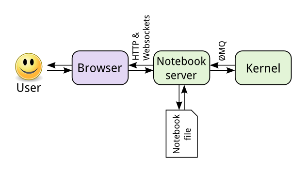
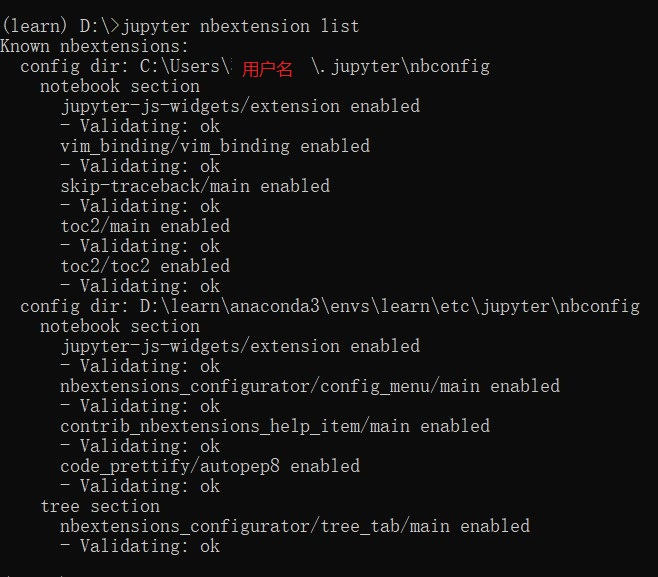
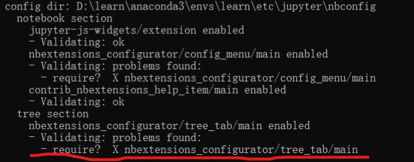

jupyter 的基本配置，各配置文件和配置路径的说明。<br>
为 jupyter notebook 配置插件，并解决各种可能遇见的报错。<br>
jupyter lab 以指定配置目录开启的 bat 脚本，本身就有插件安装界面所以不进行插件的说明

<!-- more -->

> 本篇文章是是在 anaconda 环境下进行说明的，但普通环境下同样适用。

> <p style="color:red;">不想费事儿的直接跳到2.1直接安装算了，插件根据自己选择，2.2有说明</p>

# 1. 开始准备

## 1.1. 快速进入指定环境

对于使用 anaconda 的用户，[前面](/posts/anaconda-init/)有提到 anaconda 为什么不用配置环境变量，
在此处可以仿照 anaconda 那个 cmd，自己实现一个进入特定环境的 cmd。避免每次都要自己切换环境，浪费时间。

1. 创建 cmd 快捷方式
2. 修改快捷方式中的目标为

```
个人：
%windir%\System32\cmd.exe "/K" D:\learn\anaconda3\Scripts\activate.bat D:\learn\anaconda3 && conda activate learn

!!!注意activate的路径和环境名称要换为自己的
也可以自己添加 && cd ..... 来切到指定位置（注意先切盘符）
```

这样避免了每次都要打 activate 指令

## 1.2. 了解 jupyter

Jupyter Notebook 的本质是一个 Web 应用程序，便于创建和共享文学化程序文档，
支持实时代码，数学方程，可视化和 markdown。 用途包括：数据清理和转换，数值模拟，统计建模，机器学习等等

- 架构图：

  > 

  - 服务器读取文件，并藉此生成 html 页面
  - 用户使用浏览器访问页面，进行交互操作
  - 服务器接收用户代码输入，调用内核 kernel 处理
    > jupyter 支持几十种语言，ruby,r 等都可以通过添加内核完成支持
  - 服务器读入内核输出，并返回结果输出到浏览器上

- 拓展：

  > 服务器接收用户的代码数据具体原理拓展：[网址](https://www.cnblogs.com/wuyongqiang/p/8040225.html)

- 历史(摘自 wiki)：

  > 2014 年，Fernando Pérez 宣布从 IPython 中衍生出一个名为 Jupyter 的项目。IPython 继续以 Python shell 和 Jupyter 内核的形式存在，而 IPython Notebook 和其他与语言无关的部分移到了 Jupyter 名下。Jupyter 是语言无关的，它的名称是对 Jupyter 支持的核心编程语言的引用，这些语言是 Julia、Python 和 R， 它支持几十种语言的执行环境（也就是内核），这些语言包括 Julia、R、Haskell、Ruby，当然还有 Python（通过 IPython 内核）。

  > 2015 年，GitHub 和 Jupyter 项目宣布 Jupyter Notebook 文件格式（.ipynb 文件）在 GitHub 平台上可以原生渲染。

## 1.3. jupyter 命令与子命令

> 会在操作过程中对这些命令进行说明，此处只是了解

通过`jupyter -h`可以查看所有命令参数以及子命令。比如通过`jupyter --paths`可以查看 jupyter 所有相关的路径。


- 主要用到的命令
  - jupyter
  - jupyter notebook： 在当前目录开启 jupyter-notebook
  - jupyter lab 在当前目录开启 jupyter lab
  - jupyter nbextension： notebook 插件管理
  - jupyter labextension ：lab 插件管理命令
  - jupyter nbextensions_configurator 插件管理
  - jupyter nbconvert： 文档转换

<p style="color:red">可以发现jupyter安装完成后本身就有 jupyter nbextension等命令，也就是有加载jupyter插件的模块，而我们要做的，只是添加插件</p>

## 1.4. jupyter 相关路径

> 具体会在配置过程中进行说明

`jupyter --paths`结果：


- 三类：
  1. config:配置文件路径
  2. data：数据文件路径，包括 notebook 插件文件
  3. runtime:运行时生成文件路径，包括临时 html 等
- 三行分别对应：
  > 通过`jupyter nbextension -h`可以查看插件安装相关指令和选项
  > 请动手试试，可以查到下面的三个选项 <p id="user-sys"></p>
  1. 第一行目录是 **为用户安装**对应目录，对应`--user`
  2. 第二行目录是 **在所在 env 环境安装**对应目录，`--sys-prefix`。不同 env，只有该条不同
  3. 第三行目录是 **全局安装**对应目录，对应`--system`,**默认**
- 其他：
  - python 模块：jupyter 相关的的 python 模块位于：`env路径/Lib/site-packages/`下，和所有 python 第三方模块位置相同
  - jupyter 命令及子命令所在位置：`env路径/Scripts/`

# 2. noteboo 配置过程

## 2.1. 安装 jupyter notebook

```
conda用户：
进入目标环境下
conda install jupyter notebook

普通用户：
pip install jupyter notebook
```

然后通过`jupyter notebook`开启 jupyter notebook

## 2.2. 插件直接安装(个人不推荐)

> <p style="color:red;">不想费事儿的，看看这个就行了，想了解jupyter自定义配置方式的，请看2.3</p>

> 直接安装插件包和依赖模块，非强迫症应该够用，虽说可能会遇到各种报错和警告，但不影响基本使用。

- 安装
  ```
  # 使用anaconda安装jupyter插件包:
  conda install -c conda-forge jupyter_contrib_nbextensions
  # 使用pip进行安装：
  pip install jupyter_contrib_nbextensions
  ```
- 图形化界面设置：

  > 
  > 在此处可以开启与设置插件

- 可能遇见问题：
  > 安装后会可能出现这种错误(此处只是演示，实际可能会超长一串)：具体原因会写在下面
  - 问题 1：插件启用错误
    > 
  - 问题 2：配置文件重复
    > 
  - 问题 3：浏览器控制台插件报错。

## 2.3. 插件自定义安装

> 给那些看见 warning 就心烦的人

### 2.3.1. 单插件安装示例

> 这里从 github 下载插件源码进行安装，主要为了说明插件的安装方式，安装 jupyter_contrib_nbextensions 与之大同小异，此处以 vim 插件为例，**非 vim 用户不必根据流程安装该插件，或可以选择其他插件**

- 进入安装了`jupyter notebook`的环境，此处使用`learn`环境
- 下载源码：[地址](https://github.com/lambdalisue/jupyter-vim-binding)
- 假设此处 zip 放在 `D:\\`
- 目录切到`D:\\`
- 为`learn`环境安装 vim 插件：
  > 
  - 查看提示可以发现，安装插件就是把 zip 解压到指定目录，此处使用的`--sys-prefix`选项，所以只会为本环境安装插件。
  - 关于三个选项上面有进行说明：<a href="#user-sys">跳转</a>
  - 另外，`jupyter nbextension install`指令只能解压 zip 包，对于其他包，也可以事先解压为文件夹，在进行安装，该指令会直接把插件拷贝到指定目录。当然，如果只是手动将插件复制到指定目录也行，但要确保目录复制正确
- 现在去指定目录下就可以发现插件对应的文件夹
- 开启插件：`jupyter nbextension enable jupyter-vim-binding-master/vim_binding --sys-prefix`
  - 注意：必须是`插件文件夹名称/核心js名称`
    > 有些文件夹下不止有一个核心 js，比如 `code_prettify`下有 autopep8,2to3 等多个插件，选择需要的开启即可
  - 加上`--sys-prefix`会把插件开启信息写入到
    `env路径\etc\jupyter\nbconfig\notebook.json`
    > 例：D:\learn\anaconda3\envs\learn\etc\jupyter\nbconfig\notebook.json
  - 开启插件时会在三个目录下查找插件
  - 当然，如果不想调用命令，也可以通过自己修改配置文件的方式开关与配置插件
- `jupyter nbextension list`查看插件列表
  - 如果开启插件时名称错误，会有这种类型的报错：
    > <br>
    > 该报错原因是三个插件目录中都没有找到`nbextensions_configurator/tree_tab/main.js`
- `jupyter notebook`开启 notebook

> 此处示例的 vim 插件只通过 js 就实现了该插件的所有功能，所以可以正常使用。但有些插件的部分功能有 python 模块依赖以及 jinja2 模版依赖，比如 jupyter_contrib_nbextensions 中的 toc2，需要根据文档安装固定模块

### 2.3.2. jupyter_contrib_nbextensions 模块安装说明

- 开始之前，推荐先去[github 详情页](https://github.com/ipython-contrib/jupyter_contrib_nbextensions)把项目下载下来做个备份，避免误删啥东西
- 安装 jupyter_contrib_nbextensions：
  ```
  # 使用anaconda安装jupyter插件包:
  conda install -c conda-forge jupyter_contrib_nbextensions
  # 使用pip进行安装：
  pip install jupyter_contrib_nbextensions
  ```
- 主要使用模块说明(红线画出):
  > 
  - 模块说明
    - jupyter_contrib_nbextensions
      > contrib 时 contribute 的缩写
      - 说明：几十个插件的包和相关依赖的 python 模块，Jinjia2 模版等
      - [详情见 github 地址](https://github.com/ipython-contrib/jupyter_contrib_nbextensions)
    - jupyter_nbextensions_configurator
      - 说明：插件控制的图形化模块，可以在图形化界面进行插件的开启，关闭与配置
      - [详情见 github 地址](https://github.com/Jupyter-contrib/jupyter_nbextensions_configurator)
  - 模块位置：`env路径\Lib\site-packages\`
  - 插件释放位置：`env路径\share\jupyter\nbextensions`
    > 会把所有插件都放在这里，也就是 `jupyter nbextension install ..... --sys-prefix`所安装到的目录

### 2.3.3. 插件配置

- 可以通过图形化界面配置
  > 
  - 注意：在图形化界面配置时最终会将配置写入到`~/.jupyter/nbconfig/notebook.json`中
    > 如果多个 conda 环境都有 jupyter notebook 的话，可能会因为配置混用儿导致各种错误。
    > 那样的话建议更改完后将配置内容复制到`env路径\etc\jupyter\nbconfig\notebook.json`中，再删除配置文件，争取配置文件互相独立
- 插件配置示例：
  > 
  - 公用插件
    - 将多个环境通用的插件放在了`‪C:\ProgramData\jupyter\nbextensions\notebook.json`
      > 即 `--system`
    - 然后将共用插件和键位等的配置文件放在了`~\.jupyter\nbconfig`
      > 即`--user`，只是感觉比较近所以放在了这里，也能放在`--system`
  - 环境私用插件
    - 将只有该环境用的插件放在了` D:\learn\anaconda3\envs\learn\share\jupyter\nbextensions`
      > 即 --sys-prefix
    - 将只有该环境用的配置文件放在了`D:\learn\anaconda3\envs\learn\etc\jupyter\nbconfig\notebook.json`
      > 即`--sys-prefix`
- 配置文件(仅供参考)：
  - --user
    ```json
    // --user
    {
      "load_extensions": {
        "jupyter-js-widgets/extension": true,
        "vim_binding/vim_binding": true,
        "skip-traceback/main": true,
        "toc2/main": true,
        "toc2/toc2": true
      },
      "Cell": {
        "cm_config": {
          "lineNumbers": true
        }
      },
      "keys": {
        "command": {
          "bind": {
            "m,c": "jupyter-notebook:change-cell-to-code",
            "m,m": "jupyter-notebook:change-cell-to-markdown",
            "m,r": "jupyter-notebook:change-cell-to-raw",
            "ctrl-shift-q,ctrl-shift-q": "jupyter-notebook:close-and-halt",
            "ctrl-alt-s": "jupyter-notebook:toggle-all-cells-output-scrolled",
            "shift-t": "toc2:toggle-toc",
            "shift-b": "jupyter-notebook:toggle-menubar",
            "shift-v": "jupyter-notebook:toggle-all-cells-output-scrolled"
          },
          "unbind": ["shift-v"]
        }
      },
      "Notebook": {
        "Toolbar": true
      }
    }
    ```
  - --sys-prefix
    ```json
    // --sys-prefix
    {
      "load_extensions": {
        "nbextensions_configurator/config_menu/main": true,
        "contrib_nbextensions_help_item/main": true,
        "code_prettify/autopep8": true
      }
    }
    ```

### 2.3.4. 可能遇到问题

- 问题 1：插件启用错误
  > 
  1. `jupyter nbextension list`查看在哪个配置文件中开启
  2. 进入配置文件，将对应开启的一条配置删除
  3. 查看插件的名称，仿照**单插件安装示例**，使用`jupyter nbextension enable ...`开启
- 问题 2：配置文件重复
  > 
  1. 查看日志，进入日志中显示的两条目录下买呢
  2. 随便删除一个即可(通常是因为插件重复，那样的话最好删除其中一个目录下的插件)
- 问题 3:
  > 
  1. 去`env路径/Lib/site-packages/jupyter_nbextension_configurator/staic/nbextensions_configurator`
  2. 把该文件夹(就是一个插件)复制到三个插件目录之一（推荐复制到--sys-perfix）
     > 如果直接开启会遇到这种问题：<br> > 
  3. 删除插件目录下的配置文件`/config_menu/config_menu.yarm`,`/tree_tab/tree_tab.yaml`
     > 这里挺邪门的，命名插件加载不去读取，但插件配置文件会去读取，所以要做这个操作。

### 2.3.5. 一键启动

仅供参考，请替换为自己的安装路径

仅仅添加了 cd 到指定路径以及开启 jupyter notebook 的指令

或者也可以通过 bat 方式

- cmd 快捷方式，更改目标(有长度限制)
  ```
  %windir%\System32\cmd.exe "/K" D:\learn\anaconda3\Scripts\activate.bat D:\learn\anaconda3 && conda activate learn && d: && cd D:\learn\Microsoft VS code-workplace\project\python\python_learn\jupyter && jupyter notebook
  ```
- bat 方式

  ```bat
  call D:\learn\anaconda3\Scripts\activate.bat D:\learn\anaconda3

  d:

  call D:\learn\anaconda3\condabin\conda.bat activate learn

  cd D:\learn\Microsoft VS code-workplace\project\python\python_learn\jupyter
  rem 此处改成项目目标路径

  jupyter notebook
  ```

## 2.4. 主题

具体请查阅该篇[文档](https://github.com/dunovank/jupyter-themes)

# 3. jupyter lab 简单配置

jupyter lab 的配置路径默认使用`~/.jupyter/lab` 文件夹，此处只说明如何指定配置文件家路径。

仿照 jupyter notebook ，查看 jupyter lab -h，阅读配置项。提醒：单纯使用`-h`选项无法找到指定配置文件夹所对应的选项，可以使用：
- `jupyter lab --help-all`查看所有帮助
- `jupyter lab --generate-config`生成默认配置文档，里面可以查看所有配置项

两个配置：
- `--LabApp.user_settings_dir`:配置文件夹
- `--LabApp.workspaces_dir`:环境目录文件夹

可仿照下面文件自行配置

bat 文件：

```bat
call D:\learn\anaconda3\Scripts\activate.bat D:\learn\anaconda3
rem 进入base

d:
rem 转到d盘

call D:\learn\anaconda3\condabin\conda.bat activate learn
rem 切换环境

cd D:\learn\Microsoft VS code-workplace\project\python\python_learn\jupyter
rem 切到默认目录

jupyter lab --LabApp.user_settings_dir=D:\learn\anaconda3\envs\learn\share\jupyter\lab\config\user-settings --LabApp.workspaces_dir=D:\learn\anaconda3\envs\learn\share\jupyter\lab\config\workspaces
rem 指定文件夹存储配置文件
```

# 4. 其他

关于快速打开 bat 或 cmd：**utools(个人使用)**或**PowerToys(微软官方功能扩展)**

文件搜索：**Everything**
