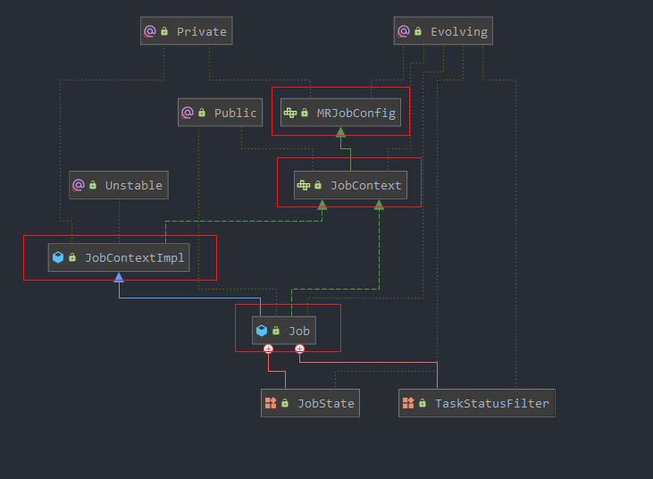
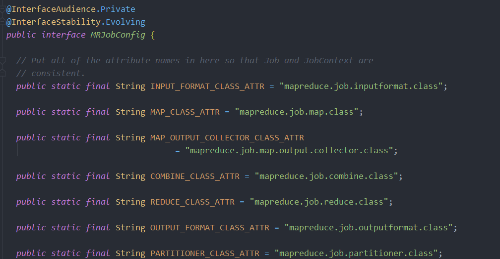
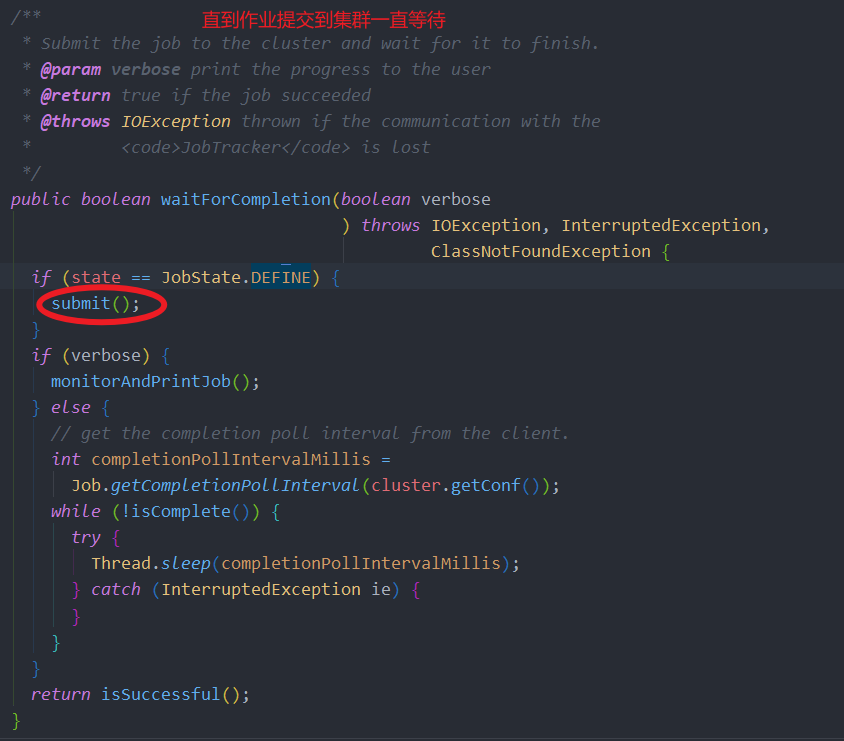
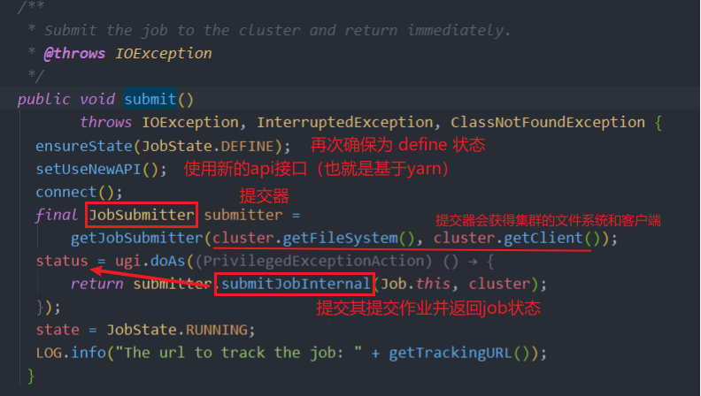
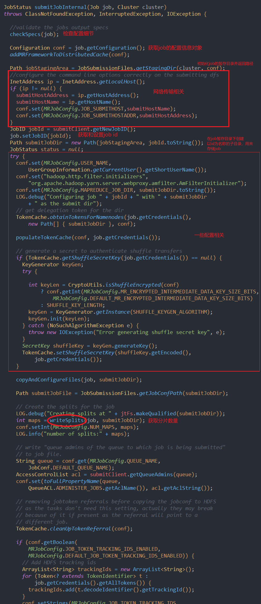
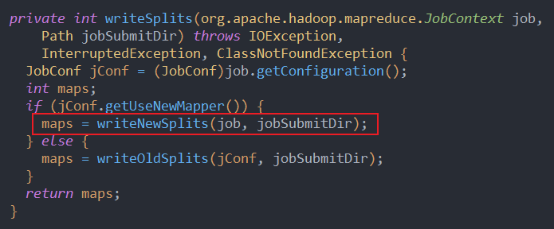
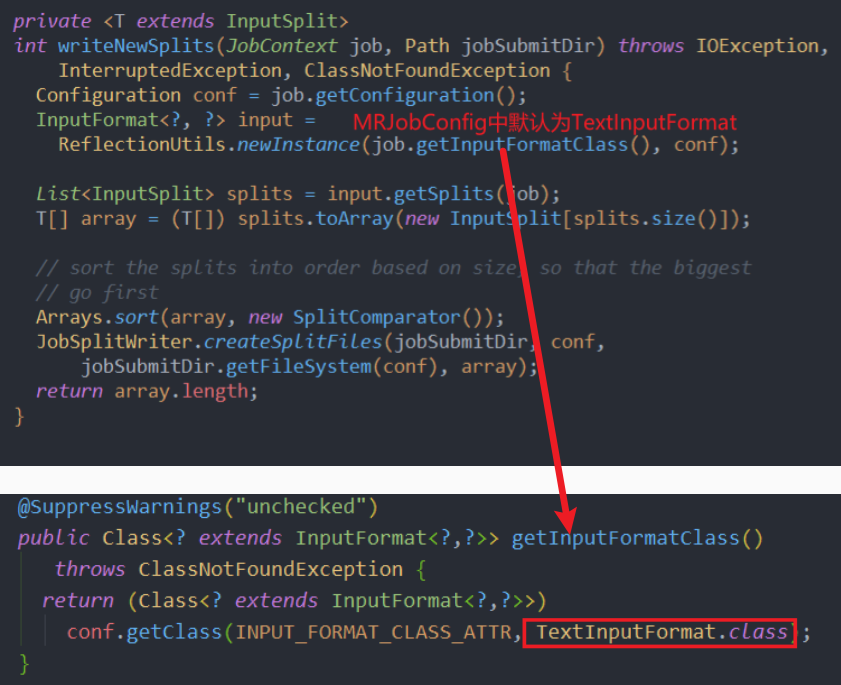
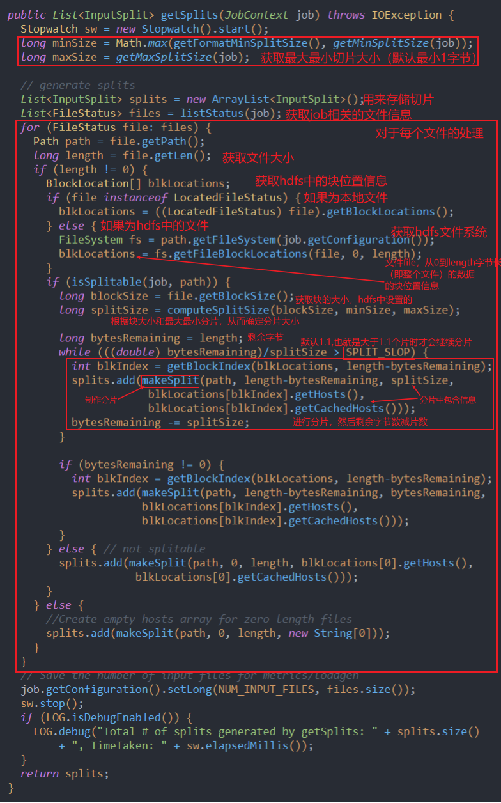
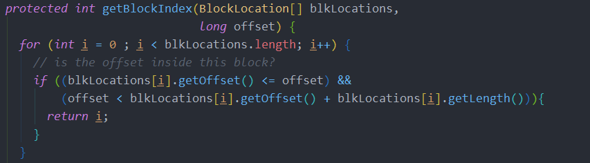
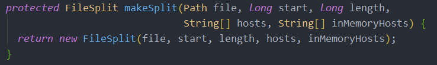

自定义一个 wordcount 的 job，并藉此深入源码。<br>
主要讲解客户端部分，分片过程。阅读需要对 MapReduce 工作流程有所了解。
<!-- more -->

# 1. 入口代码

**MyWordCount**

```java
public class MyWordCount {
    public static void main(String[] args) throws IOException, ClassNotFoundException, InterruptedException {
        Configuration conf = new Configuration();
        Job job = Job.getInstance();

        job.setJarByClass(MyWordCount.class);

        job.setJobName("MyWordCount");

        // hdfs目录
        Path inPath = new Path("/user/root/test.txt");
        Path outPath = new Path("/output/wordcount");

        FileInputFormat.addInputPath(job,inPath);

        // 如果输出路径存在，就删除
        if(outPath.getFileSystem(conf).exists(outPath)){
            outPath.getFileSystem(conf).delete(outPath,true);
        }

        // 设置输出
        FileOutputFormat.setOutputPath(job,outPath);
        // 手动创建 MyMapper.class,MyReducer.class
        job.setMapperClass(MyMapper.class);
        // 告知reduce，map输出的数据类型，否则reduce无法反序列化，会报错
        job.setMapOutputKeyClass(Text.class);
        job.setMapOutputValueClass(IntWritable.class);
        job.setReducerClass(MyReducer.class);

        // Submit the job, then poll for progress until the job is complete
        job.waitForCompletion(true);
    }
}
```

# 2. 源码解析

## 2.1. 流程图

## 2.2. job 设置



Job 类相关的类的继承关系见上图

---



其中 job 实现 MRJobConfig 接口，而该接口定义了默认的 job 配置，比如 mapper 类的设置等等，可以通过 job.setXXX()修改默认配置。

运行时会读取配置类中的信息，通过反射创建配置中指定的类

## 2.3. 提交+分片



waitForCompletion()方法会等待提交 job 完成，其中会调用 submit()方法进行提交。

---



通过提交器的 submitJobInternal 方法实现 job 的提交，并返回作业状态

其中 submitJobInternal 会完成一下几部分工作：

- 检查 job 的输入输出配置信息
- 计算切片的数量。
  > 因为切片数量=map 数量，所以需要切片后才能设置 map 数量
- 为分布式缓存建立必要的信息
- 将 job 的 jar 包和配置提交到 hdfs 的 mr 系统目录当中
- 提交 job 到资源管理（jobTracker 或 ResourceManger）

---



writeSplits 会做好分片，然后返回分片数量

---



使用新的 Mapper 接口，查看分片方法 writeNewSplits

---



首先获取 InputFormat 接口的实现类。其中 InputFormat 会读取 conf 对象中设置的类，通过反射方式获得对象。

如果没有设置，所以会默认获取 TextInputFromat 实现类（可以通过 job.setInputFormat()来设置）

InputFormat 类主要由两个功能：

- 逻辑分片
- 数据转换为 k-v 类型
  > MapReduce 在 map 阶段和 reduce 阶段处理的都是 k-v 类型数据，所以从硬盘读取文件时也要转换为 k-v。

---






TextInputFormat 继承了 FileInputFormat，而 getSplits()在 TextInputFormat 中并没有重新实现。所以要去 FileInputFormat 查看该方法。

split 的尺寸：

- Max:获取切片最小尺寸
  > 如果想切片小于块，可以设置 Max 小于块大小
  > `FileInputFormat.setMaxInputSplitSize`
- Min:获取切片的最小尺寸
  > 如果想切片大于块，可以设置 Min 大于块大小
  > `FileInputFormat.setMinInputSplitSize`

FileStatus 可以通过传入 path 用来获取块位置信息主要用来获取文件的块位置信息(包括块大小，位置分布等等),
然后根据块信息结合分片的最大最小值确定片的大小

bytesRemaining 用来存储还剩下多少字节用来分片，每分片一次就会减去分去的长度

获取**每一个 split 的开始位于的块还以及该块上的多少偏移量**:

- getBlockIndex()用来获取指定偏移位于第几块
  - blkLocations 是块位置信息，通过它的长度可以确定总块数，
  - length-bytesRemaining 是当前的偏移量。
- 如果 当前 block 的 offset 大于 offset 大于 当前 block 的 offset+当前 block 长度时。说明位于该块上
- 而偏移量(对于整个文件)就是 length-bytesRemaining

然后获取 FileSplit 对象，存储分片的信息：


- file-文件名
- start-要处理的文件中第一个字节的位置
- length-要处理的文件（片）的字节数
- hosts-将对应块存储在磁盘上的主机列表
- inMemoryHosts-将对应块存储在内存中的主机列表

其中当剩余的数据小于 split 大小的 1.1 倍时，就会跳出循环，将剩下的所有数据分成一个 split。目的是避免一个 split 存储的数据过少，浪费 io 资源

最后获得所有 split，并返回 Split 的 List
> split最后会交由 RecordReader，实现文件到k-v的转换

之后经由 WriteNewSplits 和 WriteSplits,将分片数量返回给提交方法 SubmitJobInternal

<br>
<br>
<br>
<br>

> 题外话：本想先写完架构分析再发的，不过暂时没那么多时间，之后会补上

