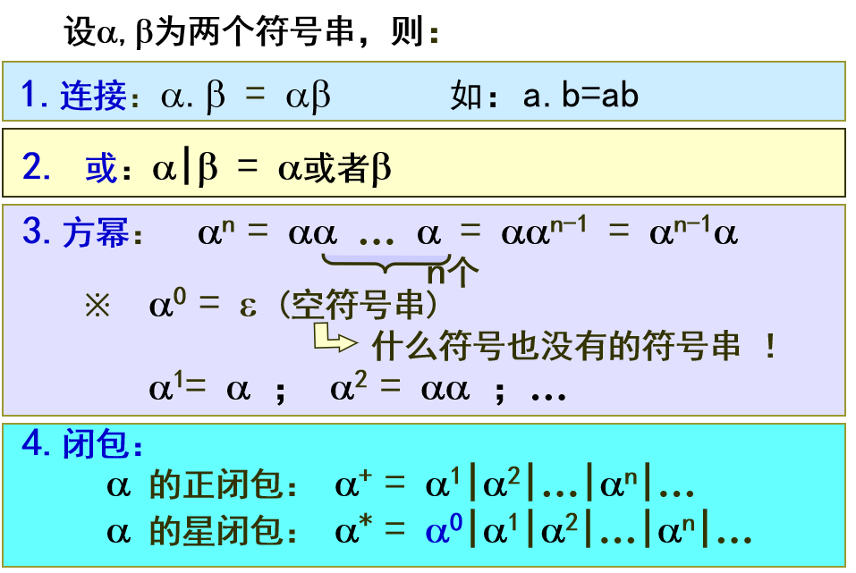
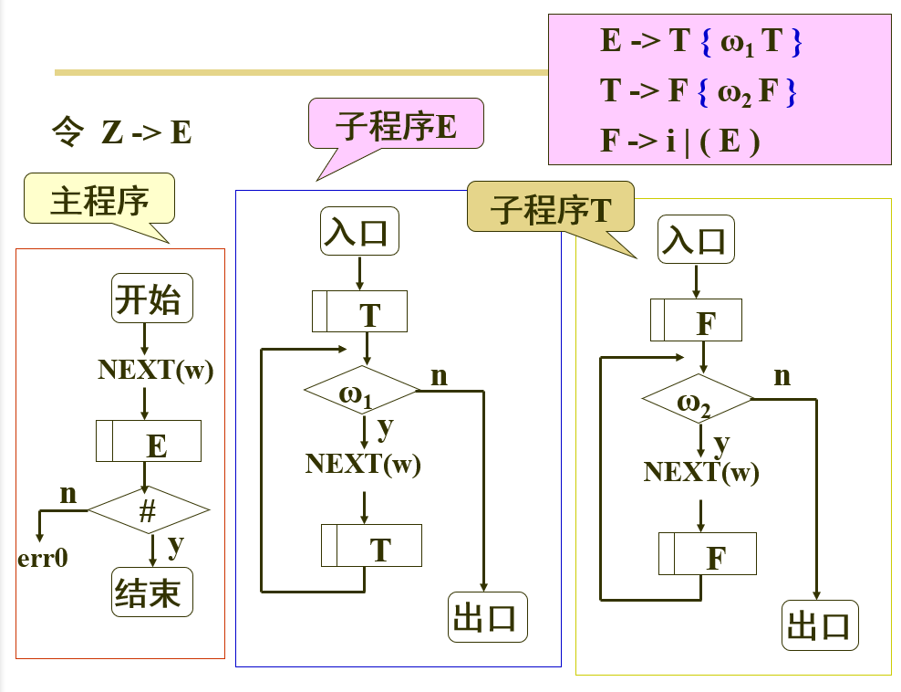

大二的时候，大学课程的学习笔记，放到博客上备份

<!-- more -->

成绩与教材
===

- 一次课堂测验 10%
- 一次课后作业 20%
- 两次实验 30%
  - 第二次实验可以验收。验收可以提高成绩
- 学习报告 40%

- 教材：
  - 编译原理与实践

- 参考书：
  - 编译原理 胡伦骏
  - 编译原理 龙书
  - 程序设计语言编译原理 陈火旺

- 三本经典：
  - 龙书 1986,2006
  - 虎书 1997
  - 鲸书

- 章节
  - 1 介绍。2学时
  - 2 形式语言。一切的基础。6学时
  - 3 自动机基础 6学时
  - 4 词法分析 2学时。 词法分析器实验。不做验收。有参考代码
  - 5 语法分析 6学时
  - 6 语义分析 6学时。 语法分析+语义分析 实验。既可以合并，语法和语义分析也可以分别做。
  - 7 优化 2学时。可选操作
  - 8 机器语言生成 2学时

- 实验完成形式：
  - 单人完成两次实验
    - 第二个实验，三种方法中 **选一个**
      - 递归子程序太简单了，给分最低，也就是合格，不接受验收
      - 其他两种方法要求验收
        > 但也比词法分析简单
  - 3-5人一组完成一个完成的编译器。

# 1. 编译原理介绍

- 翻译程序：将一种语言程序转换为另一种语言程序的程序, 按照对象不同分别有：
  - 转换程序( transformation ) --- 把一种高级语言转换成另一种高级语言；
  - 编译(compile)程序 --- 把某种高级语言转换成某种低级语言;
  - 解释(interpreter)程序 --- 把某种高级语言转换成某种低级语言;
  - 汇编程序( assembler ) --- 把汇编语言转换为机器语言的翻译程序。
  - 反编译( decompile ) --- 将汇编语言反编译为高级语言
  - 反汇编( disassembler ) --- 将机器语言反汇编为汇编语言
 
- 流程：
  > 

- 编译程序与解释程序的主要区别:
  - 编译程序(compiler)
    - 是一种翻译程序，
    - 它特指把某种高级程序设计语言翻译成与之**等价**的具体计算机上的低级程序设计语言。
    > 
  - 解释程序(interpreter)也是一种翻译程序，
    - 它将源语言书写的源程序作为输入，解释一句后就提交计算机执行一句，
    - 并不形成目标程序。
    > 
  - 区别
    - 前者有目标程序而后者无目标程序；
    - 前者运行效率高而后者便于人机对话。

- 编译程序5个阶段
  > 
  - 编译前端
    - 词法分析：scanner。得到**token**
    - 语法分析：parser。得到**语法树**
    - 语义分析：semantic analyzer。得到**中间代码**
  - 编译后端
    - 优化处理：code optimizer。得到**优化中间代码**
    - **目标代码**生成：code genreator
  - 其他相关：
    - 前后端有规定接口。
      - 如果从window上移到linux
      - 只要重写后端
    - 错误处理：
      - 编译时可能会出现报错
    - 符号表 symbol table：
      - 里面存放用户自己定义的标识符
      - scanner 建立
      - 语法与语义进行补全
      - 代码生成和运行时可能用到

- 以英文翻译做对比：
  - 词法分析 -- 识别单词,确认词类;
  - 语法分析 -- 识别短语和句型的 语法属性；
  - 语义分析 -- 确认单词、短语和句型的 语义特征；
  - 代码优化 -- 修辞、文本编辑；
  - 代码生成 -- 生成译文。

- 编译过程实例分析**（重要）**
  - 程序

    ```
    int a1,b;
    . . .
    b = a + 2 * 5;
    ```
  - 词法分析：
    ```
    扫描器会滤除源程序中不必要的符号，如注释，多余空格等。过程中还会将各种名字填入符号表。
    得到：类别--单词
      关键字 (k) -- int
      标识符 (i) -- a，b
      常  数 (c) -- 2，5
      界  符 (p) -- ,  ;  =  +  *

    转换为token二元组：(单词，类型)
    token:
      (b , i)
      (= , p)
      ...
    ```
  - 语法分析
    > 其中语法规则都是通过形式语言记录的。所以形式语言是所有的基础
    - 得到token序列。生成语法树
    - b = a + 2 * 5  的分析过程如下所示
      > 
      - token1:发现b为标识符
      - token2:发现界符=
      - 判断为赋值语句，建立赋值操作节点
      - 每种节点下子节点有很多种，比如term下可以为factor或者factor*factor
      - 根据token往语法树中填。
      - 如果能正确完成语法树，就说明语法正确

  - 语义分析
    - 构建标识符的语义辞典---符号表
      > 
      - int a,b;  : 填写类型一列
    - 构造语句的语义树---中间语言；
      > 
  - 代码优化：
    - 常数合并
      > 
      - 将2*5 直接计算出来
      - 减少临时变量t1
    - 其他...
  - 代码生成
    > 
    - R 为寄存器
    - 三条指令分别为：存、加 和 取 。
    - 过程
      1. 把10存入寄存器R
      2. 将R中的值与a地址处的数据相加，再存入R中
      3. 把R中的值存入b地址处

- 编译程序实现机制：
  - 遍：编译程序对源程序或等价程序从头至尾扫描的次数。
  - 典型的情况是两遍的编译程序：
    - 第一遍: 词法分析、语法分析和语义分析；
    - 第二遍: 中间代码优化和目标代码生成。
  - 第一遍解析：
    >  .
    - parser为主程序
    - parser调用sanner和semantic analyzer
    - 首先调用scanner，请求一个token
    - 得到返回后进行分析
    - 然后继续请求token
    - 当parser得到一个语法单元后，再发给 semantic analyzer进行语义分析
    - 然后继续请求token
  - 每遍中的各阶段的工作是穿插进行的，
    ```
    使语法分析器处于核心位置。
    当语法分析需要下一个单词时，就调用词法分析器，识别一个单词；
    一旦识别出一个语法单位，就调用语义分析器，完成语义分析并产生中间代码。
    ```

- 编译器的构建：
  - 语言种类：
    - 源语言
    - 实现语言：实现编译器的原因
    - 目标语言
  - 自编译：源语言和实现语言相同
    - 先使用汇编实现源语言的小型编译器
    - 然后再用源语言实现其他方面
    - （一般不会使用）
  - 不同机器上，只用重新实现编译器后端。
  - 编译器自动构建工具：
    - 工具
      - Scanner Builder:LEX
      - Parser builder:YACC
      - compiler builder:整个编译器自动生成现在还没有成熟的工具
    - 输入:
      - 词法规则:可以完全形式化
      - 语法规则:可以完全形式化
      - 语义解释:没有完全形式化，所以较难

# 2. 形式语言基础

## 2.1. 概述

- 背景
  ```
  计算机处理语言，首先应考虑语言的形式化、规范化，使其具有可计算性和可操作性；
  这就是形式语言理论研究的问题。
  形式语言诞生于1956年，由Chomsky创立。
  通常，语言研究至少涉及三个方面：语法、语义和语用；
  ```
- 基本观点：语言是符号串的集合
- 基本问题：研究符号串集合的
  - 表示方法
  - 结构特性
  - 运算规律

## 2.2. 形式语言是符号串集合(重)

### 2.2.1. 概念

- 名词：
  - 字母表 -- 元素(符号)的非空有限集合，比如标识符，计算符号
  - 符号串/句子 --元素（符号）构成的有限序列
  - 符号串集合 -- 有限个或者无限个符号串组成的集合；
  - 规  则 -- 以某种形式表达的在一定范围内共同遵守的章程和制度；这里，指符号串的组成规则。

- 形式语言:是字母表上的符号按一定的规则组成的所有符号串集合；其中的每个符号串称为一个句子。
- 例
  >  <br/>
  >  <br/>
  >  指空字符串
  >  <br/>

**因为很多符号串集合是无限的，所以要通过一定的规则(文法)进行表示**

### 2.2.2. 符号串的计算

- 规则
  > 

- 示例：
  > 

### 2.2.3. 符号串集合运算

- 规则
  > 
  - 方幂：n个A的乘积

- 示例：
  >  <br/>
  >  <br/>
  > 

## 2.3. 形式语言是由文法定义的(重)

- 描述形式语言两种方式：
  - 枚举方式
    ```
    语言为有穷集合时
        设有字母表A={a,b,c},
        有 L1={a,aa,ab,ac}, L2={c,cc}  .........
    ```
  - 文法:**用有穷的集合刻画无穷的集合的工具。**
    ```
    // 重要
    语言为无穷集合时，无法枚举
      设有字母表B={0,1}, B的正闭包={0,1,00,10,11,01,000,…}
      用 A 表示B的正闭包，可以表示为四个 产生式(右递归形式)
        A->0  A能作为0
        A->1  A能作为1
        A->0A  A能作为A再拼上0
        A->1A A能作为A再拼上1

        或者写成一句： A->0|1|0A|1A

      使用产生式推导出10010:
      A=>1A       把A替换为0A后
       =>10A      把A替换为0A后
       =>100A     把A替换为1A后
       =>1001A    把A替换为0后
       =>10010
    ```

- 定义： 文法(grammar)是规则的有限集，通常可以表示为四元组
  - 说明：
    > 
    - Vn : 非终结符集 ( 定义的对象集，如：语法成分等 ) ；最后都会被替换。
      > 比如上面例子中的 1A,0A
    - Vt : 终结符集 ( 字母表 ) ；
    - Z : 开始符号 ( 研究范畴中最大的定义对象 ) ；
      > 比如上面例子中的 A
    - P : 规则集 ( 又称产生式集 ) ；
    - 其中：
      > 
      - 大写英文字母表示非终结符号
      - αγ等表示字符串
      - 终结符号要看具体语言
  - 示例：
    > **文法可能有多个，但最终产生的符号串集合相同。**<br />
    > 也就是两个文法**等价**，但不相等
    - 文法1
      >  <br/>
      > 
      - S->aAc
        - a,c已经固定，先写出，但是中间有不确定个b，所以使用非终结符号A进行替换
      - A->bA|空字符串符号
        - 如果A->bA的话，就没办法把A替换成终结符号，推导就停不下来了
    - 文法2：
      - S->aAc|ac
      - A->bA|b

- 文法定义的语言
  > 

- 利用文法表示语言的过程
  - 步骤：
    - 从开始符号出发，对符号串中的定义对象，采用推导的方法（用其规则右部替换左部）产生新的符号串
    - 如此进行，直到新符号串中全部为终结符号为止，最终的符号串就是一个句子。
  - 示例
    > 

- 利用文法表示标识符
  - 目标：以字母开头的数字字母序列
  - 文法定义：
    > 
  - 得到规则集P
    > 
- 利用文法表示无符号整数
  > 
- 利用文法表示简单算术表达式
  > 
  > 其中p为：<br />
  > 
  - 要考虑优先级，|分割的几项有顺序
  > 

## 2.4. 各种语法成分的定义

### 2.4.1. 文法的运算

- 推导
  > 
- 规约
  > 

- 最右与最左
  > 扫描源程序时，都是从左向右，所以最左推导用的比较多
  - 最左
    > 
  - 最右
    > 

### 2.4.2. 句子，句型和语法树

- 句型:由文法开始符号加推导出的任一符号串。（可以包含终结符号）
  > 
- 句子:由开始符号加推导出的任一终结符号串。是一个句型的特殊情况。
  > 
- 语法树： 句型(句子)产生过程的一种树结构表示(基于推导过程)。是无法看出来推导顺序(比如最左推导)的。
  - 树根—开始符号；
  - 树叶—给定的句型(句子)。
  > 

- 示例：
  > 
  > 

### 2.4.3. 短语、简单短语和句柄

- 定义：
  - 短语:任一子树的**树叶全体**(具有共同祖先的叶节点符号串)皆为短语；
  - 简单短语:任一简单子树的树叶全体(具有共同父亲的叶节点符号串)皆为简单短语；
  - 句柄:一个句型的最左简单短语称为该句型的句柄。
    - 也就是每次最左推导的第一个推导
    - 句柄实际上并不是语法树推导出来的。之后会讲
- 例1：
  > 
  > 
  > 
- 中文语法例2：
  > 
- 例3
  > 

## 2.5. 两类特性文法

### 2.5.1. 递归文法

> 

- 作用：递归文法是定义无限语言的工具,递归文法定义的语言有无限个句子

### 2.5.2. 二义性文法

- 介绍：若文法中存在这样的句型，它具有两棵不同的语法树，则称该文法是二义性文法。
  > 

- 文法二义性的消除
  - 【方法1】不改变文法的原有规则,加进一些非形式的规定。
    > 针对上面例子
    > 加进运算符的优先顺序和结合规则 对G(E)，规定*优于+，*和+服从左结合
  - 【方法2】构造一个**等价的无二义性文法**，将排除二义性的规则合并到文法中
    > 

- 注意区分：二义性的文法和二义性的语言
  - 二义性语言：有两种文法可以表示这个语言，称为语言二义性

## 2.6. 文法等价

- 定义：文法的等价性是指它们所定义的语言(即字符串的集合)是一样的
  > 一个语言，其描述文法并不唯一。
- 目的：
  - 有时文法过于复杂，需要化简
  - 语法分析时对文法有一定要求

### 2.6.1. 文法的化简

- 文法的化简是指消除如下无用产生式：
  1. 删除A->A 形式的产生式(自定己)；
  2. 删除不能从其推导出终结符号串的产生式(不终结)；
    - 算法
      > 
    - 示例：
      > 
      - 第一轮：
        - 第一步：ADG能产生终结符号，把ADG放入Vvt
        - 第二部，把B放入Vvt
      - 第二轮
        - 第一步，没有
        - 第二部，把S放入Vvt
      - 第三轮
        - 无
        - 无
      - 因此Vvt={ A,D,G,B,S }; 应删除C,E
        > 
  3. 删除在推导中永不可到达的产生式(不可达/不可用)。
    > 不可达：如何推导都无法到达的字符串<br />
    > 没有出现在产生式右侧的符号一定不可达<br />
    > 出现在产生式右侧的符号不一定可达
    - 算法：
      > 
    - 示例：
      > 依旧是上面那个题
      - 接着上面的推导结果
      - 开始符号S一定可达，S可以产生B，B可以产生A
      - Vus = {S,B,A}，应删除 D,G(连同其产生式)
      - 结果：
        > 

### 2.6.2. 删除空字符串

- 原因：
  - 任何一个程序都不应该把空文件识别为正确程序
  - 语法分析时，有空字符串会使句柄的查找变得困难
- 算法
  > 
- 示例
  ```
  S->aAbc|bS
  A->dABe|空字符串
  B->A|b

  能产生空字符串的有：A,B
  ```
  > 

### 2.6.3. BNF（巴科斯范式）表示法

- 基本思想：扩展文法，引进新的**文法符号**
  - 必选项：() 圆括号
    > 
  - 可选项：[] 方括号
    > 
  - 重复可选项：{} 花括号
    > 可以去掉左递归
    > 

## 2.7. 形式语言的分类

- Chomsky 把形式语言分为四类，分别由四类文法定义；四类文法的区别在于产生式的形式不同：
  > 
  - 0 型语言 由 0型文法定义， 又称 无限制文法
    >  <br />
    > 基本上没什么用
  - 1 型语言 由 1型文法定义， 又称 上下文有关文法
    > 
  - 2 型语言 由 2型文法定义， 又称 上下文无关文法
    >  <br />
    > 也就是之前一直用的，**通常用来定义文法规则**
  - 3 型语言 由 3型文法定义， 又称 正规文法
    >  <br />
    > 十分严格，**通常用来定义词法规则** <br />
    > 使用正规文法定义的语言称为正规语言

# 3. 自动机

- 目的：
  - 使用正规文法产生式的推导进行词法分析也行
  - 但是有限自动机和正规文法等效。而且要比通过正规文法生成要简单得多

- 说明：
  ```
  自动机是一种语言模型，是语言的一种识别工具，
  其中的有限自动机(FA,Finite Automata)被用来处理正规语言(使用正规文法定义的语言称为正规语言)
  正规语言是编译程序设计中词法分析的对象。
  ```

## 3.1. 正规语言及其描述方法

- 定义：
  - 正规语言是指由正规文法定义的语言；程序设计语言中的单词，大都属于此种语言。

- 正规文法仅有三种形式的产生式
  > 
- 正规语言有三种等价的表示方法：
  - (1) 正规文法
  - (2) 正规式(类似正则表达式)
  - (3) 有限自动机

- 正规文法表示法
  >  <br />
  > 写起来会比较费劲
- 正规式表示法：
  - 正规式是指由字母表中的符号，通过以下三种运算(也可以使用圆括号)连接起来构成的表达式e
    > 优先级递减
    - 闭包(* , +)
    - 连接 (.)
    - 或(|)
  >  <br />
  > 

- 有限自动机表示法
  >  <br />
  >  <br />
  >  <br />
  > 

- 对比：
  > 
  ```
  凡是能由上述三种方法中的一种表示的语言，
  一定是正规语言；反之，凡是不能由上述三种方法表示
  的语言，一定不是正规语言。
  ```

## 3.2. 有限自动机的定义与分类

### 3.2.1. 定义说明

- 定义：有限自动机是一种数学模型，用于描述正规语言,可定义为五元组：
  >  <br />
  > 

- L(FA)生成示例
  >  <br />
  > 最好不要有空字符串的边，任何一个状态向自己转变都可以认为有一条空字符串变。所以这里把开始状态也设置成了结束状态

- 有限自动机的两种表现形式
  > 
  - 存储时，都是以变换表的形式存储。
    > 稀疏矩阵压缩

### 3.2.2. 分类：DFA 与 NFA

- 有限自动机分类：
  > 题目：
  - **确定有限自动机(DFA)**
    - 特点：
      - 开始状态唯一
      - 变换函数单值
      - 不带空字符串边。
    - 示例
      > 
  - **不确定有限自动机(NFA)**
    - 特点：
      - 不满足确定有限自动机的任意一条特点
    - 细分：
      > 
    - 示例
      - 联合式
        - 先匹配一个，再匹配另一个
        > 
      - 组合式
        > 都是正确的，但是不好用
        - 模式1:
          > 
          - 开始状态不唯一
          - 变换函数不单值(1,a)=(2|4))
        - 模式2：
          > 
          - 带有空字符串边

## 3.3. 有限自动机的等价转换

### 3.3.1. 介绍

- 背景：
  - 非确定机(NFA) 较易构造，但不好用！
  - 确定机 (DFA) 较难构造，但好用！
  - 任何一非确定机NFA，皆可通过有效算法把其转化为等价的确定机DFA（二者描述的语言相同）。
- 目的：按照一定流程构造出好用的确定机
- 等价转换种类：
  - (1) 有限自动机的确定化( NFA=>DFA);
  - (2) 有限自动机的最小化( DFA=>最小的DFA);
    > 又称有限自动机的最小化,又称有限自动机的化简

### 3.3.2. 什么是等价

#### 3.3.2.1. 有限自动机等价

- 定义：设有两个有限自动机FA1和FA2，若L(FA1)= L(FA2)则称FA1与FA2等价，记作FA1等价于FA2。
  - 例：
    > 

#### 3.3.2.2. 状态等价

- 定义：
  - 设 i 和 j 为FA的两个状态，若把其看作初态，二者接受的符号串集合相同，则有 i等价于j
  - 若两个状态存在空字符串环，那么两个状态一定是等价状态
  - **同一个状态是等价状态的特殊情况**
  - 例：
    - 例1
      > 
    - 例2
      > 

### 3.3.3. 有限自动机的确定化

#### 3.3.3.1. 第一步--NFA去空字符串边

- 若存在空字符串闭路
  - 步骤1：
    > 
    - 把空字符串闭路上各节点合而为一
    - 结束
- 若不存在空字符串闭路
  - 步骤1：因为空字符串边，导致出现有隐含的开始态和结束态。要标记出来
    > 例：
    - 若开始状态或隐藏开始状态发出的空字符串边到达一个状态，那么到达的状态是隐含开始状态
      > 开始状态是空字符串，加一个空字符串（也就是什么都不做），到达另一个状态，所以那个状态应该也是开始状态
    - 若有个状态通过空字符串边指向结束状态，那么该状态是隐含结束状态

  - 步骤2
    > 例：
    - 对空字符串边，按空字符串通路逆向逐一进行
      - 删除一个空字符串边；同时引进新边
      - 凡由原空字符串边终点发出的边，也要由其始点发出。
      - 例子：
        - 2->3有一个空字符串边
        - 3->5有个边
        - 因此添加2->5
  - 步骤3：重复步骤(3)，直到再无空字符串边为止。

- 整体示例：
  > 

#### 3.3.3.2. 转化为DFA

- 算法
  > 

- 示例
  > 

### 3.3.4. 有限自动机的最小化算法

- 最小有限自动机
  - (1) 没有无用状态(无用状态已删除)
  - (2) 没有等价状态(等价状态已合并)

#### 3.3.4.1. 删除无用状态

> 两个算法，第二个较简单

- 构造有用状态集算法1：
  > 
- 构造有用状态集算法2：
  > 

#### 3.3.4.2. 合并等价状态

- 两个状态i,j等价的条件
  - 必须同是结束态，或同不是结束态；
  - 对所有字母表上符号，状态 i , j 必变换到等价状态。
    ```
    比如
    i-a->{x}
    j-b->{y}
    x,y必须也是等价状态,否则i,j就不是等价状态
    # 好家伙就是一个递归
    ```
  - 示例：
    > 
    - 根据是否为结束状态，划分为两个子集
      > 
    - 判断等价：
      > 
    - 结果
      > 

- 具体算法(划分不等价状态集)
  > 

#### 3.3.4.3. 示例

- 删除无用状态：(上面也有)
  > 
- 合并等价状态
  > 
- 得到结果
  > 

## 3.4. 有限自动机的实现

- 实现机制：控制程序+变换表

### 3.4.1. 控制程序结构设计

- 说明：
  - (1) 假定自动机只作为**识别器**，即对**待识别**的符号串： 仅回答 是(接受) 或 否(拒绝)。
  - (2) 为便于处理，可令 # 作为**待识别的符号串的后继符**。为此，扩展自动机如下：
    > 
  - (3) 令 getchar(ch) 为读符号函数。
- 实验流程图：
  > 

### 3.4.2. 变换表存储结构设计

- 二维数组
  > 
- 压缩变化表
  > 

### 3.4.3. 示例


## 3.5. 正规语言描述方法间的相互转换

### 3.5.1. 正规文法<=>DFA

- 对应关系
  > 
- 自动机=>正规文法 示例
  > 
- 正规文法 => 自动机, 并求 L(G) 示例
  > 

### 3.5.2. 正规式 <=> DFA

- 转换机制
  > <br />
  >  先拆 乘，变成一条路。再继续分解
- 正规式 => 自动机 示例
  > 

### 3.5.3. 习题

不止一种答案

#### 3.5.3.1. 正规式=>的DFA

 <br />


#### 3.5.3.2. DFA => 正规式


### 3.5.4. 补充：Kleene 闭包 验证 DFA与正规式等价

TODO: Kleene构造法

## 3.6. 算法实现

### 3.6.1. NFA确定化

### 3.6.2. DFA最小化

# 4. 词法分析

## 4.1. 说明

- 词法分析程序又称扫描器，任务有两个
  - 识别单词(使用有限自动机)
  > 从用户的源程序中把单词分离出来;
  - 翻译单词
  > 单词转换成机内表示，便于后续处理。

## 4.2. 词法分析的基本概念

### 4.2.1. 单词的分类

- 标识符:用户给一些变量起的名字；
- 常数:以自身形态面对用户和系统；
- 特殊符:
  - 关键字:系统内部定义，具有固定的意义， 通常用来区分语法单元；
  - 界符:
    - 单字符界符 `+  -  *  /  , ; : =  < `
    - 双字符界符: `<=  <>  >=  ==   /*  */  `

### 4.2.2. 单词的识别

- 字母开头:关键字或标识符；
- 数字开头:数值型常量；
- `"`或`'`开头：字符型常量或字符串常量；
- 其它多数以自身形态识别之，如+,-,=,...
- 关键字和标识符的识别
  ```
  现在，大多数编译程序使用 保留字 ，即关键
  字不能用作标识符。系统预先造好关键字表，拼好
  的字符串，先查“关键字”表，查到了，视为关键字，否则，视为标识符。
  ```

### 4.2.3. 单词的机内表示--Token

- 目的：
  - 程序设计语言的单词不但类别不同，而且长短不一
  - 通过token可以：
    - 长短统一；
    - 语法、语义信息分开。
- 表示
  > 
- 设计方案
  > 

## 4.3. 词法分析程序的设计

### 4.3.1. 内部组成


- 识别器 --- 识别单词的有限自动机
- 翻译器 --- 根据有限自动机所识别出的对象，完成从单词串到单词的TOKEN串的翻译。

### 4.3.2. 模式

- 单独的扫描器：
  - 扫描所有源程序，生成所有token
  > 
- 作为语法分析器的子程序
  - 语法分析器会向扫描器传递getward命令
  - 扫描器扫描一个单词，生成一个token
  - 返回给语法分析起
  > 

### 4.3.3. 简单词法分析器示例

#### 4.3.3.1. 有限自动机的设计


- 泛指单词后继符：**除了字母和数字以外其他的任意符号**
- 每一个单词都要从开始状态到结束状态走一遍

```
示例：int a1:=22
int 识别：
  i--2状态
  n--2状态
  t--2状态
空格:int 识别结束，然后再1状态上空转一次
a1 识别：
  q--2状态
  1--2状态
:=  识别
  :--a1识别结束，到达6状态
  =--到达7状态。之后遇到2，到达结束状态
22 识别
  .....
```

#### 4.3.3.2. 流程图


- 示例：
  > 
  - 各个表：
    > 
  - token生成
    > 

## 4.4. 算术常数处理机的设计

### 4.4.1. 说明

- 带有翻译功能的自动机称为处理机；其结构可分为两个部分：
  - (1)  识别器（有限自动机主机）
  - (2)  翻译器（在自动机的状态节点处，插入翻译子程序）
- 算术常数处理机的功能:
  - 字符型转换为数值型
  - 只能识别算术常数
  - 不能识别标识符和界符等

### 4.4.2. 识别器设计

- 算数常数基本形式
  > 
- 识别器的设计
  > 

### 4.4.3. 翻译器设计

- 参数设置(val(d)字符转数值函数)
  > 
  ```
  拼 尾数值 变量
  比如12：
    读到1，是1
    读到2，是1*10+2
  如果在小数点后面，继续拼尾数
  m用来记录小数点后有几位

  p用来记录e的多少次方

  具体可以看看示例
  ```
- 结果变量：
  > 

- 函数设计
  > <br><br>
  > 

### 4.4.4. 常熟处理机程序框图


### 4.4.5. 示例


## 4.5. 词法分析工具

### 4.5.1. lex/flex

unix 上是 lex

flex 是 gnu 版本的 lex

# 5. 语法分析

> 直接使用上下文无关文法直接进行的分析

## 5.1. 基本概念

### 5.1.1. 定义与分类

- 定义：形式上说，语法分析是指对给定的符号串（α），判定其是否是某文法G(Z)的句子。即
  > 

- 分类：
  - 自顶向下法
    > 
    - 递归子程序法
    - LL(1)分析法
  - 自底向上法
    > 
    - LR()分析方法
    - 算符优先分析方法(有些过时)

### 5.1.2. 算法分析设计

#### 5.1.2.1. 两大类

- 自顶向下分析的关键技术是如何确定具有相同左部的产生式之侯选者！
  > 

- 自底向上分析的关键技术是如何确定当前句型的句柄(找简单子树)！
  > 
  - 观察语法树构造过程：
    > 
  - 其中每次的句柄为：
    > 

#### 5.1.2.2. 三个算法

## 5.2. 递归子程序法

### 5.2.1. 设计与算法

- 要点总结
  - **判断为yes后，匹配上之后，才能读下一个单词**
  - **子程序不需要判断**

- 递归子程序法的设计原理
  - 递归子程序法属于自顶向下语法分析方法。故又名递归下降法
  - 设计原理：
    - 对每一个非终结符，构造一个子程序，用以识别该非终结符所定义的符号串。
    - 每个子程序以产生式左部非终结符命名，以产生式右部构造子程序内容。
  - 递归子程序构造示例1：
    >  <br />
    > 
  - 算法总结
    > 
  - 递归子程序构造示例2：
    > 

    ```
    abc#：

    调用S子程序
      (读取a)
      匹配到a
    调用A子程序
      (读取b)
      无法匹配，退出
    返回S子程序(现在要匹配的还是b)
      匹配到b
      (读取到c)
    从S跳出
      c，而不是#
    报错
    ```
- 递归子程序对文法要求
  ```
  递归子程序是根据文法各产生式的首符号与当前所读单词进行匹配，以决定候选产生式的；这就要求文法：
  (左递归文法将使自上而下分析过程陷入无限循环.)
  ```
  - 条件：
    - 具有相同左部的各产生式，首符号不同；
    - 文法不能有左递归！
  - 如：
    > 
  - 归纳：**递归子程序要求文法应是LL(1)文法!**

- 算术表达式构造示例3
  > 
  - 消除左递归
    > 
  - `{}`根据含义，在流程图中应该代表循环
  - 画出程序流程图
    > 
    > 
  - 判断示例
    ```
    a+b*c#
    ```

### 5.2.2. 消除左递归

#### 5.2.2.1. BNF 表示法消除左递归

花括号消除左递归

#### 5.2.2.2. 消除直接左递归

消除产生式中的直接左递归是比较容易的。例如假设非终结符P的规则为 `P→Pα/β`

其中，β是不以P开头的符号串。那么，我们可以把P的规则改写为如下的非直接左递归形式：

- `P→βP’`
- `P’→αP’|ε`

这两条规则和原来的规则是等价的，即两种形式从P推出的符号串是相同的。

- 示例1
  - 设有简单表达式文法G[E]：
    - `E→E+T|T`
    - `T→T*F|F`
    - `F→(E)|I`
  - 经消除直接左递归后得到如下文法：
    - `E→TE’`
    - `E’→+TE’|ε`
    - `T→FT’`
    - `T’→*FT’|ε`
    - `F→(E)|I`

- 示例2
  - 考虑更一般的情况，假定关于非终结符P的规则为
    - `P→Pα1|Pα2|…|Pαn|β1|β2|…|βm`
  - 其中，αi（I＝1，2，…，n）都不为ε，而每个βj（j＝1，2，…，m）都不以P开头，将上述规则改写为如下形式即可消除P的直接左递归：
    - `P→β1P’|β2P’|…|βmP’`
    - `P’→α1P’|α2P’|…|αnP’|ε`

#### 5.2.2.3. 消除间接左递归

消除间接左递归的方法是，把间接左递归文法改写为直接左递归文法，然后用消除直接左递归的方法改写文法

## 5.3. LL(1)分析法

### 5.3.1. 基础算法

- 说明
  ```
  LL(1)分析法是指从左到右扫描(第一个 L) 、最左推导(第二个 L)和只查看一个当前符号(括号中的 1)之意；
  LL(1)分析法又称预测分析法，属于自顶向下确定性语法分析方法。
  ```
- 基本要点：
  - (1)  利用一个分析栈，记录分析过程；
    - 每次匹配到一个非结束符的第一个，就弹出非结束符，再倒序压入
  - (2)  利用一个分析表，登记如何选择产生式的知识；
  - (3)  此分析法要求文法必须是 LL(1)文法。
- 示例：
  > 
  - 思考：
    - (1) 选择推导产生式后，为什么要逆序压栈?
    - (2) 当栈顶为A,当前单词为c时，为什么选择 A ->空字符串?

- 算法总结：
  > 

### 5.3.2. LL(1)文法

#### 5.3.2.1. 首符号集合,后继符集合，选择符集合

> 

- 注意：
  > 

- 其他注意点：

  ```
  后继符号集合：

  B->aAD  // D能推导为bAa，所以b也是A的后继符号
  D->bAa
  A的后继符集合为b,a
  ```
  ```
  选择符集合:

  能不能推导出　空字符串，是两种情况
  ```
- 示例：
  > 

- β 不为空是指β推导不出空字符串

  ```
  S->aBb
  B->aA

  S=>aBb=>aaAb

  follow(A)时， 要先找所有产生式右侧有没有A
  发现B->aA,
  follow(B)属于follow(A)

  必须推出终结符号才行
  ```

#### 5.3.2.2. 定义

- 文法定义：
  > 

> 有左递归肯定不是LL1文法

- 示例：
  > 

### 5.3.3. LL1分析器设计

> 不是LL1文法要进行等价变换(BNF)

#### 5.3.3.1. 分析表


> 当用非终结符A向下推导时，面临输入符号a时，所应采取的候选产生式


#### 5.3.3.2. 控制程序


> 这个控制程序实现了之前描述的算法
>
> 从栈中弹出的符号X，如果既不是终结符，也不是非终结符，那么，它一定是#
>
> 匹配后才读下一个字符串

- 四个数据集合
  - 终结符号存起来
  - 非终结符号存起来
  - 产生式右侧存起来
  - 分析表存起来

### 5.3.4. 练习


---


---


---


---


## 5.4. LR()分析法

### 5.4.1. 基本概念

#### 5.4.1.1. 说明


---


#### 5.4.1.2. 算法示例


#### 5.4.1.3. 句柄识别


### 5.4.2. 句柄识别器

#### 5.4.2.1. 说明


---


- 5-2：A->  XX.非终结符

---


#### 5.4.2.2. 例


### 5.4.3. LR()分析器

#### 5.4.3.1. 基本组成与设计


---


- 一个分析表
- 产生式存储map
- 一个栈或两栈

#### 5.4.3.2. LR(0)分析器设计


---


---


---


---


#### 5.4.3.3. SLR(1)分析器设计


---


#### 5.4.3.4. 示例1


---


---


---


#### 5.4.3.5. 示例2


---


## 5.5. 语法分析工具

在语法分析这一块，程序员有两种实现方式，一种是纯手工编码来实现算法，然后制作语法分析器，第二种方式就是利用语法生成器，比如每一台 Linux 上都有的 Yacc Bison 等，

这些自动生成器会根据一些语法规则来自动生成代码完成语法分析。

不过主流的编译器，比如 GCC LLVM ，其实现方式就是纯手工编码的方式，而在纯手工编码的方式中，最最常用的就是递归下降算法

### 5.5.1. ANTLR 4

ANTLR 4 使用LL(1) 算法

[ANTLR 4简明教程](https://wizardforcel.gitbooks.io/antlr4-short-course/)

### 5.5.2. Yacc/Bison 语法生成器

unix 是 YACC，而 Bison 是GNU版本的YACC

yacc: yet another compile compile，用于编译编译器的编译器

bison 实现的是 LR(1) 的一个子集 LALR(1)

# 6. 中间代码及其翻译

## 6.1. 说明

- 中间代码
  > 
- 作用
  > 

## 6.2. 示例


---


---


## 6.3. 设计

### 6.3.1. 递归子程序

### 6.3.2.

# 7. 参考

- 东北大学编译原理课件
- [语法分析的那些算法](https://www.cnblogs.com/trav/p/10458580.html)
- [消除文法的左递归](https://www.omegaxyz.com/2019/02/03/toll/)


